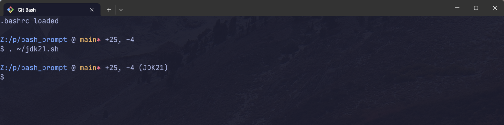

# bash_prompt

一个简单的 Bash pormpt 程序。支持特性：

- 显示当前目录
- 如果当前目录是 git 仓库，则显示当前的分支及是否有未 commit 的变更。

效果：



## 构建

需要 zig 0.12+。构建过程：

```sh
zig build -Doptimize=ReleaseFast
```

在 `zig-out/bin` 可以找到相应的 bin 文件。

## 使用

首先将 `bash_prompt.exe` 放入系统 PATH 目录中。然后在命令行中执行：

```sh
bash_prompt init >> ~/.bashrc
```

`bash_prompt.exe` 可以在 release 页面中找到。

## 设计文档

见 [RFCs]

[RFCs]: https://github.com/yuekcc/bash_prompt/tree/main/rfcs

## License

MIT
